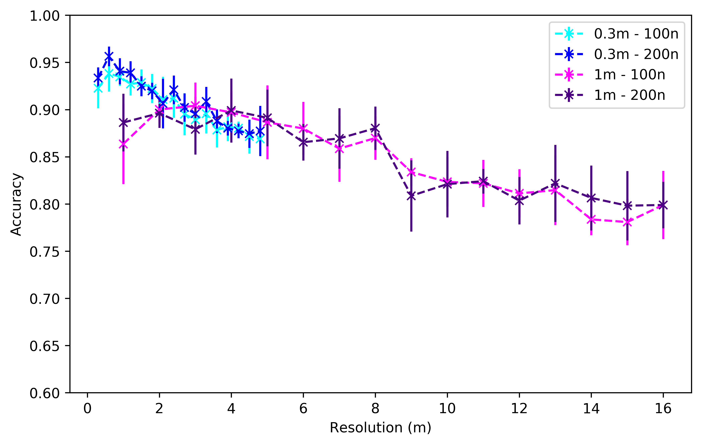
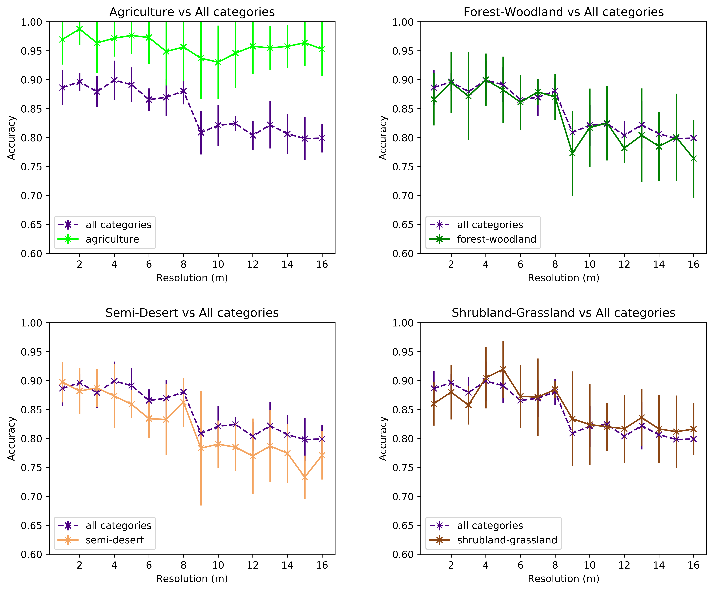

# Man-made Structures Detection from Space

Authors: *Eduard Ribas Fernández*, *Peter Weber*

Advisor: *Jordi Vitrià* (Universidad de Barcelona), *Marco Bressan* (Satellogic)

Fundamentals of Data Science Master's Thesis - Universitat de Barcelona - July 2019

> All the files used in this project, including our image datasets and generated code, are available online:
> * The images datasets are published in [Google Drive](https://drive.google.com/open?id=1Hjod1ZTuSIW3VNO2IuGoq_iagI3imnJQ})
> * All the code used in these analysis is available in a [GitHub repository](https://github.com/peterweber85/MasterThesis). It includes generated Python libraries, scripts and Jupyter Notebooks.

## 1. Introduction

Human kind exerts an ever increasing pressure on natural and ecological systems due to the associated consequences of the explosion of human population. The exploitation of the earth manifests itself in extraction of natural ressources, proliferation of human-made infrastructure and waste, and increasing production land use for crop and pastry land. 

An essential prerequisite to mitigate human threat to nature is the access to data that allows for spatial and temporal mapping of human activity. To this end, the last decades have brought about developments of affordable and recurrent remote sensing technology, with applications in agricultue, disaster recovery, urban development, and environmental mapping.

The task of detecting various types of man-made structure and man-induced change has become a key problem in remote sensing image analysis. In this respect, the Computer Vision technologies have largely benefited from recent advances in Deep Learning, ultimately leading to the outsourcing of the weights of Convolutional Neural Networks pretrained on massive datasets. In the remote sensing community, researchers are recently also starting to follow this pathway.

In this thesis we aim to provide an answer to the questions: 
> *What is the optimal resolution to detect human impact in satellite imagery, having in mind the economical cost of acquiring and processing the information?*

To do so, we collaborated with Satellogic, a company that provides earth observation data and analytics as a service to enable better decision making for industries, governments, and individuals.

Determining the optimal resolution is important not only for designing optimal satellite sensors but also to use optimal data sources when developing data-based remote sensing products. The goal here is not to build the top performance, state-of-the-art model to detect all sorts of human impact in satellite images, but rather to analyze the feasibility and cost of doing so at different resolutions.

In this work we cover the process of building the datasets needed for our investigation, some Deep Learning techniques to model the problem at different resolutions, and an extensive discussion regarding the obtained results and associated costs of the entire pipeline. The latter includes satellite costs and data processing costs.

## 2. Building datasets

In order to tackle this problem, we need a good dataset from which we can build reliable models. The goal is to detect human impact on aerial images and determine the dependency on resolution per pixel of a chosen evaluation metric. Ideally, the range for the resolutions should scale from a few tens of centimeters to a few tens of meters, whereas the images with low resolution can be generated from the high resolution images by downsampling. Therefore, the dataset has to fulfill the following conditions:

* Imagery data with labels that can be used to clearly distinguish between existing and non-existing human impact, respectively. This impact might be classified pixel wise, or as binary classification for the entire image, or as multi-class classification that can be translated into binary labelling.

* Balanced dataset of approximately the same number of images for both classes, and a large variety of different terrains within each class. 

* Resolution per pixel equal or better than 1m. Also, the height and width of the images should measure at least $500\times500$ pixels, so that downsampling can be done. 

There exist some relevant, publicly available remote sensing datasets with ground truth labels, ranging from pure low-resolution satellite imagery (Sentinel-2) to high-resolution images taken with an aircraft (USGS) to a mix of different image sources (Google Earth). The table below summarizes some of these datasets:

| name | source | images | resolution (m) | size (pixel) | categories |
| :--- | :----- | :----- | :------------- | :----------- | :---------- |
| BigEarthNet | Sentinel-2 | 590,326 | 10, 20, 60 | 120, 60, 20 | $\sim$ 50 |
| EuroSAT | Sentinel-2 | 27,000  | 10 | 64  | 10 |
| UCMerced | USGS | 2100 | 0.3 | 256 | 21 |
| DeepSat | USGS  | 405,000 | 1 | 28 | 6 |
| AID | Google Earth | 10,000  | 0.5 - 8  | 600 | 30 |
| PatternNet | Google Earth | 30,400 | 0.06 - 4.69 | 256 | 38 |

Overall, the main issue with these datasets stems from the fact that non of them was collected with the purpose to analyze the human footprint. Therefore they are very unbalanced, and do not contain sufficient variety of images for the classes without human influence. We hence decided to collect and label images by ourselves, finally opting for the USGS aerial imagery collection ([Earthexplorer USGS](https://earthexplorer.usgs.gov/)).

### USGS land cover

With this datasource and the help of the [USGS Land Cover Viewer](https://gis1.usgs.gov/csas/gap/viewer/land_cover/Map.aspx) we were able to construct a balanced and representative dataset. For the determination of relevant geographic locations we excluded cities and highly developed urban areas, and instead focussed on unpopulated areas. Specifically, we limited our image search to the four land use categories **agriculture**, **shrubland-grassland**, **semi-desert**, and **forest-woodland** that can be found in the USGS Land Cover Viewer. Note that these categories served as a rough geographic orientation to pin down geolocations of interest. 

With these given locations, we constructed two datasets with 0.3m and 1m resolution (from the High Resolution Orthoimagery datasource and the National Agriculture Imagery Program (NAIP), respectively). These images are large images of thousands of pixels, as the one below, so we implemented a pipeline to process them:

### Data processing and labeling

The datasets were build following these steps: 

1. Download large raw images.
2. Crop images of size $512\times512$ pixel from the large raw images (as the grid in the picture above).
3. Label images with either zero (no human impact), one (minimal human impact), two (clear human impact).
4. Degrade images i.e. reduce number of pixels and thereby resolution per pixel.

That way, we obtained smaller labelled images for each category. The image below shows examples of the shrubland-grassland images. Here the first row shows images with only natural structures, while the second row displays images with man-made structures (like paths, streets or buildings).

When annotating the images with labels we've put major effort into ensuring the consistency and variety of the datasets. The plots below show the distribution of the labels of the resulting datasets, from which we developed our models:

Later, when training the models, only labels 0 and 2 are considered (and renamed to 0 and 1 respectively). The intermediate labels are only used at the end to investigate the behavior of the models.

Finally, the processed and labeled images are downsampled with a Lanczos filter, an example of which is shown in the image below:

For this particular image one can observe how certain image features disappear as the image quality decreases: the building on the right side is not identifiable above 3m resolution, or the texture of the track is blurred above 4m resolution. This shows how different elements in an image are not recognizable anymore once the resolution approaches their characteristic size.

## 3. Deep Learning

**Deep Learning** (DL) models have led to vast performance improvements in a large variety of domains, and therefore have gained substantial popularity over the last decades. These models were initially inspired by the human brain and analogies in neuroscience, which is why this class of algorithms was coined **Neural Networks** (NN).

One of the most common architectures in NN are the **Convolutional Neural Networks** (CNN), which have driven major breakthroughs in visual object recognition, and image, video and audio processing. CNNs are specifically designed to process input data that has the shape of multiple arrays, such as the pixel values of a 2-dimensional image with three color channels. CNNs further take advantage of the natural properties of images i.e. they take into account that local pixel values are highly correlated, and the local statistics of images are invariant to translaction.

There exist several CNN architectures that have achieved outstanding results recently:

* The **AlexNet** was the first convolutional Neural Network that achieved remarkable results in the ImageNet classification task in 2012. It halfed the error in comparison to all competing non Deep Learning based approaches.

* The winner in 2013 was the **ZFNet**, which basically had improved hyperparameters compared to the AlexNet. 

* In 2014, two networks were developed that were significantly deeper than previous networks: the **VGG** network (with 19 layers) and the **GoogleNe**t (with 22 layers).

* A significant improvement in the ImageNet challenge was achieved in 2015 by Kaiming He et al., when they submitted **ResNet**. They introduced residual blocks that contained an identity mapping in parallel to the convolutional layer, which allowed to train a deeper network without compromising its training and test accuracy. Taking advantage of this approach they were able to design networks with a depth of up to 152 layers, which allowed for halfing the error rate of the ILSVRC challenge in 2015. 

In recent years there have been developed many networks that go beyond ResNet. Some of them are extensions of ResNet (**ResNext**), or combinations of ResNet with other architectures (**Inception-V4**), or  networks that do not make use of a residual block and instead use layer dropout (**FractalNet**). Nevertheless, ResNet is still a state-of-the-art network, and that is why we have used it for the experiments in this work.

## 4. Proposed approach

In order to train a model based on images, some sort of features need to be extracted. Traditionally, this image feature extraction was based on a set of hand-crafted detectors aimed to detect edges, corners, blobs and other feature descriptors.

More recent approaches to image classification using Neural Networks have benefited from the existing and increasing computational power, and deep Convolutional Neural Networks have been able to achieve higher performance than traditional models. Yet, training a deep CNN from scratch for a particular problem requires a large and exhaustive dataset along with a huge amount of computational power. However, it has been shown that the architectures of pre-trained NN can be reused for other purposes and achieve equally great performance. This is known as **Transfer Learning**:

### Architecture

The architecture we propose for our problem consists of the activation layers of a ResNet (ResNet50), which act as the feature extractors of our images, followed by a shallow classifier made of a single dense (fully connected) layer.

The images below show 8 activation maps both for the $10^{th}$ (top) and the $49^{th}$ (bottom) layer of a sample image from the dataset (from the agriculture category). Some of the $10^{th}$ activations are particularly sensitive to edges, shadows, or textures, which later translate into more abstract outputs at the $49^{th}$ layer.

	

Our complete architecture consists of taking the output of the last ($49^{th}$) activation layer of the ResNet as the features of our images and passing them through a single dense layer of $100$ or $200$ neurons with ReLU activation, followed by a single dense node with a Sigmoid activation acting as the classifier. This model is trained on the dataset with RMSprop optimizer and a binary cross-entropy loss function. 
	

### Training pipeline and experiments

This architecture is used to train models for several image resolutions obtained from our datasets. To do so, we do the following steps for each of the datasets:

1. Load the original images (at the original resolution) from disk along with the human impact labels and categories.
	
2. Downsample the images to the desired resolution.

3. Compute the ResNet activations (at the $49^{th}$ activation layer) of the resulting downgraded images.
	
4. Consider a stratified KFold split of the dataset (with $8$ splits) for cross-validation. That means, the dataset is split into $8$ sets with labels 0-1 equally distributed.
	
* Train the model separately for each combination of the $7$ training sets considering 30 epochs. The remaining set is used as a validation set to assess the accuracy. After training on all folds, the results of the $8$ experiments are averaged in order to obtain more consistent measures.
	
* Repeat the process for all downgraded resolutions.

The plots below show the convergence of some of the trained models trained for the $0.3m$ dataset. In general, the NN is able to converge and achieve a good accuracy (as shown in the plots), although for some particular splits of the data, it fails to converge and stays in a low accuracy point (probably due to the fact of having a relative small dataset).

## 5. Results

### Accuracy by resolution and category

The plot below shows the overall accuracies obtained for all resolutions and architectures considered in the experiments. From this we can see that similar accuracies are achieved for both datasets on the same degraded resolution, which means that both datasets are comparable and can be considered together. Also, we realize that increasing the size of the model from $100$ neurons to $200$ does not have a big impact on the accuracy, but tends to perform slightly better.

The overall conclusion from this plot is that, as expected, higher resolutions (less than $2m$) allow for greater accuracies, of over $90\%$, which means a great success considering that the images in the datasets are balanced between having or not human impact. Furthermore, accuracy is still good for resolutions between $2m$ and $8m$, staying between $85\%$ and $90\%$. From $8m$ onwards, accuracy drops to $80\%$ and the model is not able to detect more subtle elements of man-made structures.

We can now consider how these accuracies behave for each of the land use categories in the datasets. The plots below show that, for the $0.3m$ dataset (and $200$ neurons model), accuracy differs substantially between categories:

<!--img src = "../report/Figures/results/acc_res_all_categories_03m.png" width = 600px-->

	
These plots have been obtained once the model was trained for all the categories. Then, the accuracy on the validation set was computed for each individual category and over all images in the set. Although the category is not taken into account when training, we can see that the models are capable of detecting agriculture-related human impact with high accuracy (over $95\%$), without really being affected by the drop in resolution. Shrubland-grassland category also has a good accuracy, while the model performs worse in semi-desert and forest-woodland images. In conclusion, the models are able to capture textures and patterns related to agriculture quite easily, while the other categories have more variable features.

Similar results are obtained for the $1m$ dataset. The models are able to achieve a great accuracy when detecting agriculture-related human impact (over $95\%$), independently of the resolution considered, but the performance drops for the other 3 categories. The biggest drop is observed at $8m$ consistently over the three non-agriculture categories. 

<!--img src = "../report/Figures/results/acc_res_all_categories_1m.png" width = 600px-->

### Selected prediction examples

Let us see now some examples of image classifications made by the models at different cateogries. For this purpose, we will focus on the $0.3m$ dataset only.

First, we can consider some examples of correctly and wrongly classified images at the base resolution. The first set of samples (the first figure of 8 images) shows that the model accurately detects clear human impact related to agriculture (2nd picture in the second row) and paths. On the other hand, the second set shows that it might fail to detect it when the impact is subtle, covering a small region of the image, or when it can even be confused with natural structures (or vice versa).

The same kind of analysis can be done for the last resolution, $4.8m$. The next images show correctly and wrongly classified images at this resolution. The first set shows that the model detects human impact when it is still evident, even with the low resolution, but the second set indicates that it commits mistakes when the human impact evidences are lost with the downgrade process. Similarly, it might classify as man-made structures patterns that are indeed natural.

To complete the comparison, we show images that are correctly classified at $0.3m$ resolution (top row) but wrongly classified at $4.8m$. The first and third pair of images demonstrate that, when the human impact is subtle, the model missed it in the downgraded resolution. Conversely, non human activity can also be misclassified at lower resolutions (second and fourth pair of images).

Finally, we can investigate how the model behaves with images where human impact is very subtle. For this purpose, we consider the images with the intermediate label (*label 1* when building the datasets). The model has never been faced with these images, so this can give a good perception of whether the models have been able to learn relevant features of human impact. The figure below shows some of these images with the label predicted by the model in the title. Even if man-made structures in these pictures are small, the model is able to detect straight lines and shapes as human activity.

Overall, we can conclude that the model is able to achieve a great accuracy. It is able to generalize to unseen, subtle images, and still be accurate for lower resolutions, were the amount of pixels and information per images become much smaller. 
	

### Cost estimation

Finally, we discuss the financial cost associated to building and launching a satellite, and to renting infrastructure for performing the entire image processing pipeline. We further study the cost as a function of pixel resolution. However, our estimates are very rough approximations because many factors are involved and large variations occur between them. To give an example, choosing one material over the other might change the cost of manufacturing and launching a satellite by one order of magnitude. It is also completely different to have a satellite for 3 years in space, or to target a lifespan of 20 years.

Our final goal is to give an estimation of the expenditure to monitor once the entire surface of the earth (about 149 million km$^2$). To this end, we multiply the satellite cost (we assume a satellite base cost of 30 million dollars) by the ratio: time needed to scan the earth over the satellite's lifespan. Further, a satellite can map 1 million km$^2$ at 1m resolution in 4.2 days. We hence can calculate the satellite cost per km$^2$. Assuming a lifespan of 10 years we have $area = 10^6 \times \frac{10\cdot365}{4.2}~km^2$ so we obtain 
$$cost~satellite~per~km^2 = cost~satellite/area \approx 0.035~\$/km^2$$

Additionally, the table below summarizes the differents costs of the data processing pipleine compared between several references and Satellogic's advise. Here the prediction step is given by our image classification pipeline.

To finally obtain the dependence of the resolution on the total financial cost we sum the data cost per km$^2$ and the satellite cost per km$^2$ at 1m resolution, and convert to cost per pixel ($\times 10^{-6}$). We then multiply with the number of pixels necessary to cover the entire surface of the earth. Here the satellite cost per km$^2$ is a cubic function and the earth surface in pixel is a quadratic function in resolution. The result is shown in the plot below. We obtain a cost of about $\$15$ million dollars at 1m resolution with a very step slope towards better resolutions. At 0.3m resolution the cost is two orders of magnitude higher than at 1m while for worse resolutions the cost decreases by two orders of magninute when the cost is a factor 10 larger. We conclude that for worse resolutions the data processing cost is the dominating cost whereas for very good resolutions the satellite cost dominates.

	

## 6. Conclusions

From the results we observe that, as expected, the higher the resolution the better, but also that there seems to be sweet spot between $1$-$2m$ and $8m$ where, except for the more subtle forms of human activity, most of the man-made structures studied are detectable with good accuracy. This trade-off with the resolution allows to consider more cost-economic satellite solutions without dramatically compromising accuracy and utility. For instance, operating a satellite at $2m$ (or $8m$) instead of $1m$ reduces the cost approximately by a factor 6 (or $100$).

### Further work

We realize that there is still plenty of space for further work and investigations:

* Having a better dataset could help improving the investigations and opening new lines to explore. It could be improved and enlarged with more variate images, with a better and more consistent classification, and including more detailed annotations of the position and type of objects or structures appearing. This would allow to train more accurate models capable of detecting all these kind of human impact.

* Other techniques for feature extraction could be studied, like other pre-trained Neural Networks, and the parameters itself (like the number of activations to consider, the architecture of the model or the training phase) could be further fine-tuned. Additionally, the pipeline could be made more robust so that it could ingest a larger amount of data, as part of the improvements suggested for the dataset. And, of course, having a powerful computational cluster would allow to speed up the processes and target more ambitious goals.

* A more in depth study of the results could help to understand more precisely on which images the algorithms fail, what kind of information are learning (patterns, colors, shapes, etc) and how to enhance them.

* It would be interesting to have a more detailed analysis of the costs associated to all this solution, from data gathering, processing and modeling to the production implementation itself. Also, taking into account other related factors, like infrastructure needed, legal aspects and ecological footprint would give a more complete idea of the viability of global satellite image analysis.
